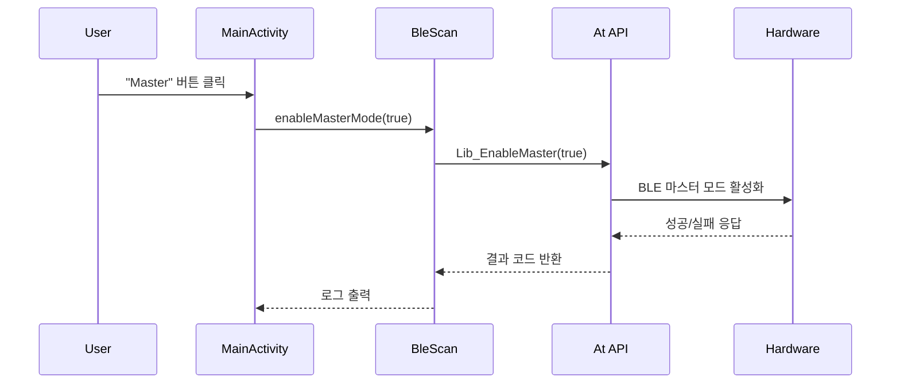
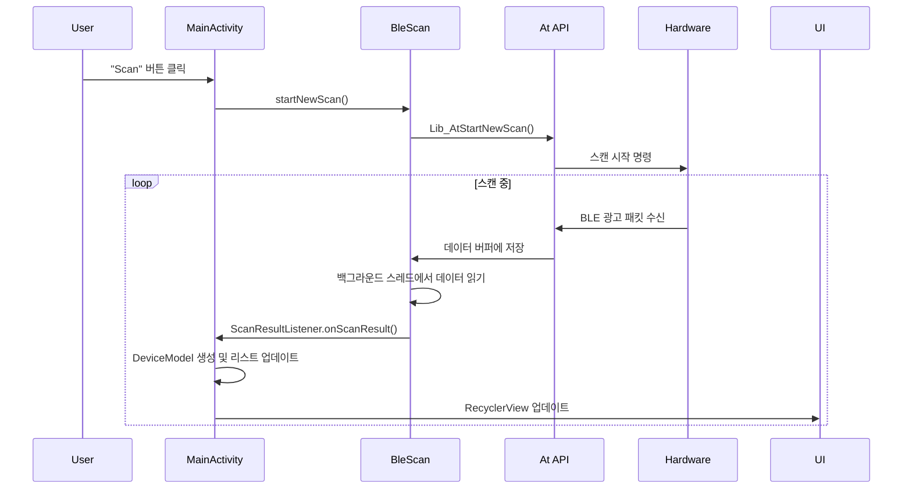
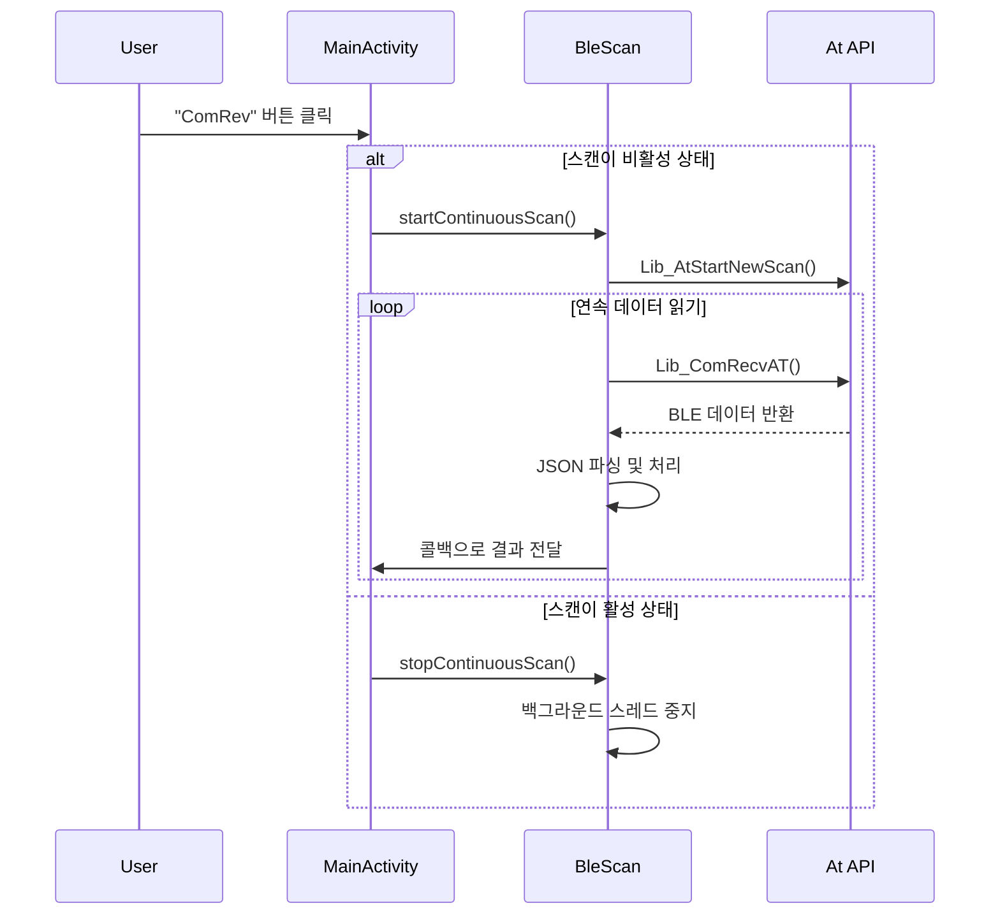
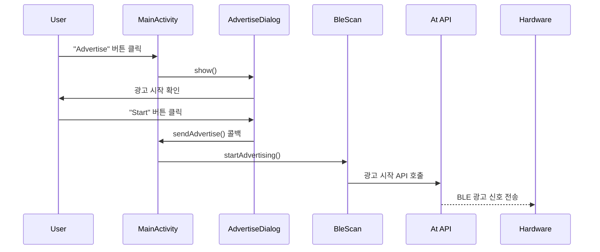
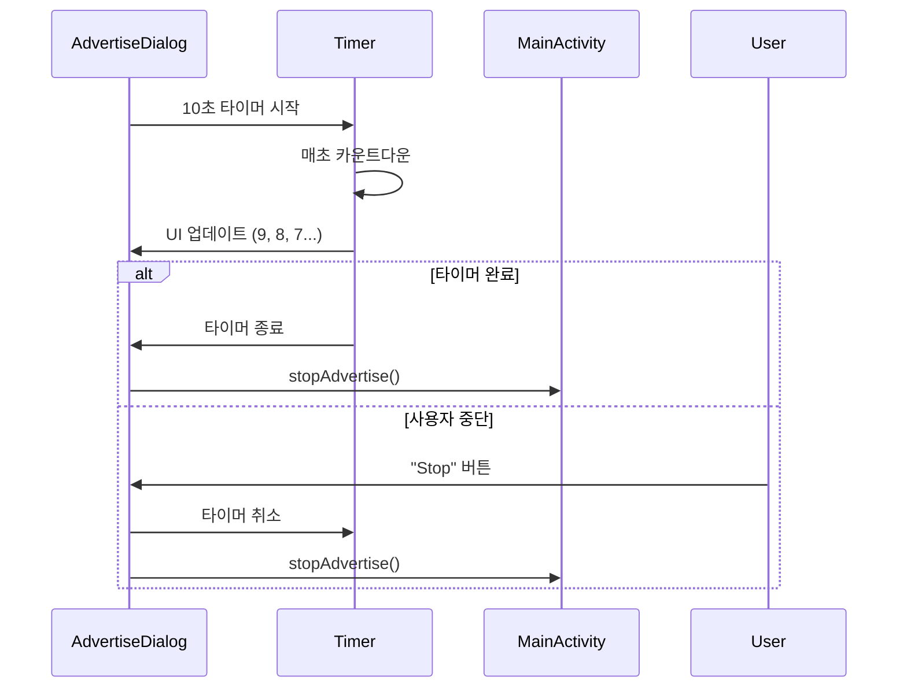

# BLE 워크플로우

## BLE 동작 개요

VPOS BLE App의 Bluetooth Low Energy 동작은 크게 **스캐닝(Scanning)**과 **광고(Advertising)** 두 가지 주요 워크플로우로 구성됩니다.

## 1. BLE 스캐닝 워크플로우

### 1.1 초기화 및 마스터 모드 설정



**코드 플로우**:
```kotlin
// MainActivity.kt
btn1.setOnClickListener {
    Step1()  // enableMasterMode 호출
}

private fun Step1() {
    val result = bleScan.enableMasterMode(true)
    Log.d("BLE_MANAGER", "Master mode enabled: $result")
}
```

```java
// BleScan.java
public int enableMasterMode(boolean enable) {
    if (isMaster == enable) {
        return 0; // 이미 같은 상태
    }
    int ret = At.Lib_EnableMaster(enable);
    isMaster = enable;
    return ret;
}
```

### 1.2 단발 스캔 워크플로우



**코드 플로우**:
```kotlin
// MainActivity.kt - 단발 스캔
private fun Step2() {
    val result = bleScan.startNewScan()
    Log.d("BLE_MANAGER", "New scan started: $result")
}
```

```java
// BleScan.java - 스캔 시작
public int startNewScan() {
    Log.d(TAG, "Starting new BLE scan");
    int result = At.Lib_AtStartNewScan();
    return result;
}
```

### 1.3 연속 스캔 워크플로우

연속 스캔은 **토글 방식**으로 동작하며, 백그라운드 스레드에서 지속적으로 데이터를 읽습니다.



**코드 플로우**:
```kotlin
// MainActivity.kt - 연속 스캔 토글
private fun toggleScan() {
    if (isScanning) {
        // 스캔 중지
        scanJob?.cancel()
        isScanning = false
        btn3.text = "ComRev"
    } else {
        // 스캔 시작
        startContinuousScanning()
        isScanning = true
        btn3.text = "Stop"
    }
}

private fun startContinuousScanning() {
    scanJob = lifecycleScope.launch(Dispatchers.IO) {
        bleScan.startContinuousReceiving { jsonData ->
            // 메인 스레드에서 UI 업데이트
            runOnUiThread {
                processScanResults(jsonData)
            }
        }
    }
}
```

### 1.4 데이터 수신 및 처리

BLE 스캔 데이터는 JSON 형태로 수신되며, 다음과 같은 구조를 가집니다:

```json
[
  {
    "deviceName": "MyDevice",
    "macAddress": "AA:BB:CC:DD:EE:FF",
    "rssi": -45,
    "txPower": 4,
    "serviceUuid": "0000180F-0000-1000-8000-00805F9B34FB",
    "serviceData": "0102030405",
    "manufacturerData": "4C000215..."
  }
]
```

**데이터 처리 플로우**:
```kotlin
// MainActivity.kt
private fun processScanResults(jsonArray: JSONArray) {
    for (i in 0 until jsonArray.length()) {
        val jsonObject = jsonArray.getJSONObject(i)
        val device = createDeviceModel(
            deviceName = jsonObject.optString("deviceName"),
            macAddress = jsonObject.getString("macAddress"),
            rssi = jsonObject.getInt("rssi"),
            txPower = jsonObject.optInt("txPower"),
            serviceUuid = jsonObject.optString("serviceUuid"),
            serviceData = jsonObject.optString("serviceData"),
            manufacturerData = jsonObject.optString("manufacturerData")
        )
        
        updateDeviceList(device)
    }
}
```

## 2. BLE 광고 워크플로우

### 2.1 광고 다이얼로그 시작



### 2.2 광고 타이머 관리

광고는 **10초 자동 타이머**로 관리되며, 사용자가 수동으로 제어할 수 있습니다.



**코드 플로우**:
```kotlin
// BLEAdvertiseDialogFragment.kt
private fun startAdvertiseTimer() {
    countDownTimer = object : CountDownTimer(10000, 1000) {
        override fun onTick(millisUntilFinished: Long) {
            val seconds = millisUntilFinished / 1000
            timerText.text = "${seconds}초"
        }

        override fun onFinish() {
            stopAdvertising()
        }
    }.start()
}
```

## 3. 벤더 라이브러리 통합

### 3.1 At API 주요 함수

| 함수명 | 용도 | 반환값 |
|--------|------|--------|
| `Lib_EnableMaster(boolean)` | 마스터 모드 설정 | int (결과 코드) |
| `Lib_AtStartNewScan()` | 새 스캔 시작 | int (결과 코드) |
| `Lib_ComRecvAT()` | 데이터 수신 | String (JSON 데이터) |

### 3.2 네이티브 라이브러리 로딩

```kotlin
// 애플리케이션 시작 시 AAR 라이브러리 자동 로딩
// app/build.gradle.kts
implementation(fileTree(mapOf("dir" to "libs", "include" to listOf("*.aar", "*.jar"))))
```

### 3.3 JNI 브리지

벤더 라이브러리는 JNI(Java Native Interface)를 통해 네이티브 코드와 연결됩니다:

```
Java/Kotlin Code → JNI Bridge → Native C/C++ Code → BLE Hardware
```

## 4. 에러 처리 및 예외 상황

### 4.1 일반적인 에러 시나리오

1. **BLE 비활성화**: 디바이스의 Bluetooth가 꺼져있는 경우
2. **권한 부족**: BLE 스캔에 필요한 권한이 없는 경우
3. **하드웨어 오류**: BLE 칩셋 문제
4. **라이브러리 초기화 실패**: 벤더 라이브러리 로딩 문제

### 4.2 에러 처리 방식

```java
// BleScan.java
public int enableMasterMode(boolean enable) {
    try {
        int ret = At.Lib_EnableMaster(enable);
        if (ret != 0) {
            Log.e(TAG, "Failed to enable master mode: " + ret);
        }
        return ret;
    } catch (Exception e) {
        Log.e(TAG, "Exception in enableMasterMode", e);
        return -1;
    }
}
```

## 5. 성능 최적화

### 5.1 메모리 관리
- 디바이스 리스트 크기 제한
- 오래된 스캔 결과 자동 제거
- 비트맵 이미지 최적화

### 5.2 배터리 최적화
- 불필요한 연속 스캔 방지
- 백그라운드에서 스캔 빈도 조절
- 화면 꺼짐 시 스캔 일시정지

### 5.3 UI 반응성
- 백그라운드 스레드에서 데이터 처리
- 메인 스레드 블로킹 방지
- RecyclerView DiffUtil 사용 고려