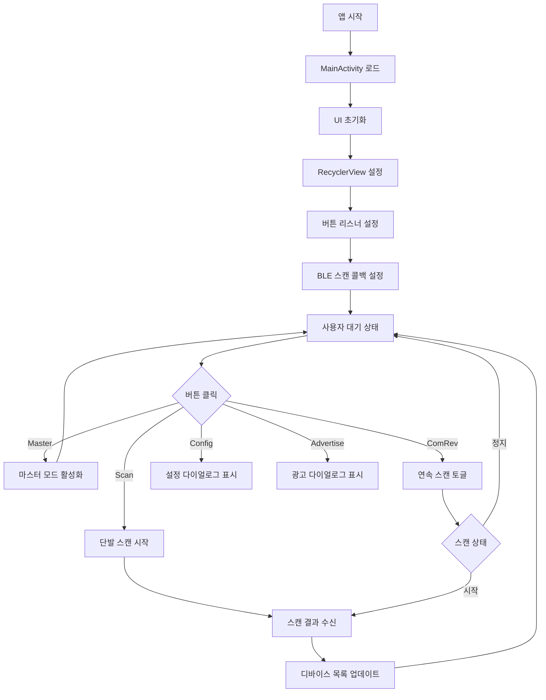
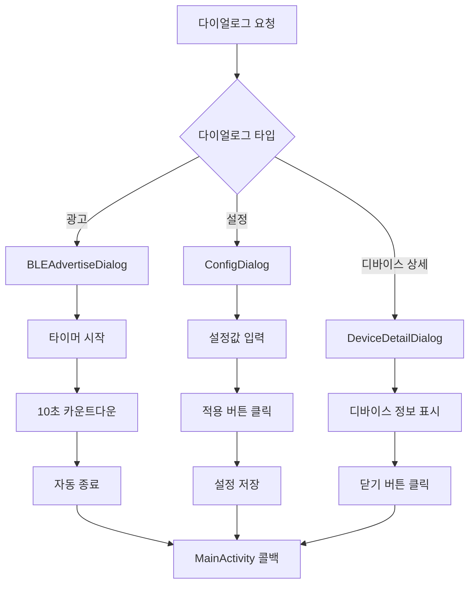

# UI 구조 분석

## UI 레이아웃 개요

VPOS BLE App의 사용자 인터페이스는 **메인 액티비티**와 **다이얼로그**로 구성되어 있으며, Material Design 가이드라인을 따릅니다.

## 1. 메인 화면 (activity_main.xml)

### 전체 레이아웃 구조

```xml
<?xml version="1.0" encoding="utf-8"?>
<LinearLayout xmlns:android="http://schemas.android.com/apk/res/android"
    android:layout_width="match_parent"
    android:layout_height="match_parent"
    android:orientation="vertical"
    android:padding="16dp">

    <!-- 제어 버튼 영역 -->
    <LinearLayout
        android:layout_width="match_parent"
        android:layout_height="wrap_content"
        android:orientation="horizontal">
        
        <!-- Master, Scan, ComRev 버튼들 -->
        
    </LinearLayout>
    
    <!-- 설정 및 광고 버튼 영역 -->
    <LinearLayout
        android:layout_width="match_parent"
        android:layout_height="wrap_content"
        android:orientation="horizontal">
        
        <!-- Config, Advertise 버튼들 -->
        
    </LinearLayout>

    <!-- 디바이스 목록 -->
    <androidx.recyclerview.widget.RecyclerView
        android:id="@+id/recyclerView"
        android:layout_width="match_parent"
        android:layout_height="0dp"
        android:layout_weight="1" />

</LinearLayout>
```

### 주요 UI 컴포넌트

#### 1. 제어 버튼 그룹
```xml
<!-- Master 모드 버튼 -->
<Button
    android:id="@+id/btn1"
    android:layout_width="0dp"
    android:layout_height="wrap_content"
    android:layout_weight="1"
    android:layout_margin="4dp"
    android:text="Master"
    android:background="@drawable/btn_dark_rounded"
    android:textColor="@android:color/white" />

<!-- Scan 버튼 -->
<Button
    android:id="@+id/btn2"
    android:layout_width="0dp"
    android:layout_height="wrap_content"
    android:layout_weight="1"
    android:layout_margin="4dp"
    android:text="Scan"
    android:background="@drawable/btn_green_rounded"
    android:textColor="@android:color/white" />

<!-- ComRev 토글 버튼 -->
<Button
    android:id="@+id/btn3"
    android:layout_width="0dp"
    android:layout_height="wrap_content"
    android:layout_weight="1"
    android:layout_margin="4dp"
    android:text="ComRev"
    android:background="@drawable/btn_dark_rounded"
    android:textColor="@android:color/white" />
```

#### 2. 부가 기능 버튼
```xml
<!-- Config 버튼 -->
<Button
    android:id="@+id/btnConfig"
    android:layout_width="0dp"
    android:layout_height="wrap_content"
    android:layout_weight="1"
    android:layout_margin="4dp"
    android:text="Config"
    android:background="@drawable/btn_dark_rounded"
    android:textColor="@android:color/white" />

<!-- Advertise 버튼 -->
<Button
    android:id="@+id/btnAdvertise"
    android:layout_width="0dp"
    android:layout_height="wrap_content"
    android:layout_weight="1"
    android:layout_margin="4dp"
    android:text="Advertise"
    android:background="@drawable/btn_green_rounded"
    android:textColor="@android:color/white" />
```

## 2. 디바이스 목록 아이템 (item_ble_device.xml)

### 아이템 레이아웃 구조

```xml
<?xml version="1.0" encoding="utf-8"?>
<androidx.cardview.widget.CardView xmlns:android="http://schemas.android.com/apk/res/android"
    xmlns:app="http://schemas.android.com/apk/res-auto"
    android:layout_width="match_parent"
    android:layout_height="wrap_content"
    android:layout_margin="8dp"
    app:cardCornerRadius="8dp"
    app:cardElevation="4dp">

    <LinearLayout
        android:layout_width="match_parent"
        android:layout_height="wrap_content"
        android:orientation="horizontal"
        android:padding="16dp">

        <!-- 신호 강도 아이콘 -->
        <ImageView
            android:id="@+id/ivSignalStrength"
            android:layout_width="32dp"
            android:layout_height="32dp"
            android:src="@drawable/round_signal_cellular_alt_24"
            android:layout_marginEnd="12dp" />

        <!-- 디바이스 정보 -->
        <LinearLayout
            android:layout_width="0dp"
            android:layout_height="wrap_content"
            android:layout_weight="1"
            android:orientation="vertical">

            <!-- 디바이스 이름 -->
            <TextView
                android:id="@+id/tvDeviceName"
                android:layout_width="wrap_content"
                android:layout_height="wrap_content"
                android:text="Device Name"
                android:textSize="16sp"
                android:textStyle="bold"
                android:textColor="@android:color/black" />

            <!-- MAC 주소 -->
            <TextView
                android:id="@+id/tvDeviceAddress"
                android:layout_width="wrap_content"
                android:layout_height="wrap_content"
                android:text="00:00:00:00:00:00"
                android:textSize="14sp"
                android:textColor="@android:color/darker_gray" />

            <!-- 서비스 UUID -->
            <TextView
                android:id="@+id/tvServiceUuid"
                android:layout_width="wrap_content"
                android:layout_height="wrap_content"
                android:text="UUID: N/A"
                android:textSize="12sp"
                android:textColor="@android:color/darker_gray" />

        </LinearLayout>

        <!-- RSSI 값 -->
        <TextView
            android:id="@+id/tvDeviceRssi"
            android:layout_width="wrap_content"
            android:layout_height="wrap_content"
            android:text="-50 dBm"
            android:textSize="14sp"
            android:textStyle="bold"
            android:textColor="@color/green"
            android:layout_gravity="center_vertical" />

    </LinearLayout>
</androidx.cardview.widget.CardView>
```

### 신호 강도 표시

RSSI 값에 따른 아이콘 변경:

```kotlin
private fun updateSignalIcon(imageView: ImageView, rssi: Int) {
    val (iconRes, tintColor) = when {
        rssi >= -50 -> Pair(R.drawable.ic_signal_4, Color.GREEN)
        rssi >= -60 -> Pair(R.drawable.ic_signal_3, Color.YELLOW)
        rssi >= -70 -> Pair(R.drawable.ic_signal_2, Color.ORANGE)  
        rssi >= -80 -> Pair(R.drawable.ic_signal_1, Color.RED)
        else -> Pair(R.drawable.ic_signal_0, Color.GRAY)
    }
    
    imageView.setImageResource(iconRes)
    imageView.setColorFilter(tintColor)
}
```

## 3. BLE 광고 다이얼로그 (dialog_ble_advertise.xml)

### 다이얼로그 레이아웃

```xml
<?xml version="1.0" encoding="utf-8"?>
<LinearLayout xmlns:android="http://schemas.android.com/apk/res/android"
    android:layout_width="match_parent"
    android:layout_height="wrap_content"
    android:orientation="vertical"
    android:background="@drawable/dialog_background"
    android:padding="24dp">

    <!-- 제목 -->
    <TextView
        android:layout_width="wrap_content"
        android:layout_height="wrap_content"
        android:text="BLE 광고"
        android:textSize="20sp"
        android:textStyle="bold"
        android:layout_gravity="center"
        android:layout_marginBottom="16dp" />

    <!-- 타이머 표시 -->
    <TextView
        android:id="@+id/tvTimer"
        android:layout_width="wrap_content"
        android:layout_height="wrap_content"
        android:text="대기 중"
        android:textSize="24sp"
        android:textStyle="bold"
        android:layout_gravity="center"
        android:layout_marginBottom="24dp" />

    <!-- 진행 바 -->
    <ProgressBar
        android:id="@+id/progressBar"
        style="?android:attr/progressBarStyleHorizontal"
        android:layout_width="match_parent"
        android:layout_height="8dp"
        android:max="10"
        android:progress="0"
        android:layout_marginBottom="24dp" />

    <!-- 버튼 그룹 -->
    <LinearLayout
        android:layout_width="match_parent"
        android:layout_height="wrap_content"
        android:orientation="horizontal">

        <Button
            android:id="@+id/btnStart"
            android:layout_width="0dp"
            android:layout_height="wrap_content"
            android:layout_weight="1"
            android:layout_margin="4dp"
            android:text="시작"
            android:background="@drawable/btn_green_rounded" />

        <Button
            android:id="@+id/btnStop"
            android:layout_width="0dp"
            android:layout_height="wrap_content"
            android:layout_weight="1"
            android:layout_margin="4dp"
            android:text="중지"
            android:background="@drawable/btn_dark_rounded"
            android:enabled="false" />

        <Button
            android:id="@+id/btnRestart"
            android:layout_width="0dp"
            android:layout_height="wrap_content"
            android:layout_weight="1"
            android:layout_margin="4dp"
            android:text="재시작"
            android:background="@drawable/btn_dark_rounded" />

    </LinearLayout>

</LinearLayout>
```

### 다이얼로그 상태 관리

```kotlin
private fun updateAdvertiseUI(state: AdvertiseState, timeLeft: Int = 0) {
    when (state) {
        AdvertiseState.IDLE -> {
            timerText.text = "대기 중"
            timerText.setTextColor(Color.GRAY)
            progressBar.progress = 0
            startButton.isEnabled = true
            stopButton.isEnabled = false
            restartButton.isEnabled = false
        }
        
        AdvertiseState.RUNNING -> {
            timerText.text = "${timeLeft}초"
            timerText.setTextColor(Color.GREEN)
            progressBar.progress = 10 - timeLeft
            startButton.isEnabled = false
            stopButton.isEnabled = true
            restartButton.isEnabled = false
        }
        
        AdvertiseState.COMPLETED -> {
            timerText.text = "완료"
            timerText.setTextColor(Color.BLUE)
            progressBar.progress = 10
            startButton.isEnabled = false
            stopButton.isEnabled = false
            restartButton.isEnabled = true
        }
    }
}

enum class AdvertiseState {
    IDLE, RUNNING, COMPLETED
}
```

## 4. 디바이스 상세 다이얼로그

### 결제 정보 다이얼로그 (dialog_payment_info.xml)

```xml
<?xml version="1.0" encoding="utf-8"?>
<ScrollView xmlns:android="http://schemas.android.com/apk/res/android"
    android:layout_width="match_parent"
    android:layout_height="wrap_content"
    android:background="@drawable/dialog_background"
    android:padding="24dp">

    <LinearLayout
        android:layout_width="match_parent"
        android:layout_height="wrap_content"
        android:orientation="vertical">

        <!-- 제목 -->
        <TextView
            android:layout_width="wrap_content"
            android:layout_height="wrap_content"
            android:text="결제 정보"
            android:textSize="18sp"
            android:textStyle="bold"
            android:layout_gravity="center"
            android:layout_marginBottom="16dp" />

        <!-- 디바이스 기본 정보 -->
        <LinearLayout
            android:layout_width="match_parent"
            android:layout_height="wrap_content"
            android:orientation="vertical"
            android:background="@drawable/bg_edit_rounded"
            android:padding="16dp"
            android:layout_marginBottom="16dp">

            <TextView
                android:id="@+id/tvDeviceInfo"
                android:layout_width="wrap_content"
                android:layout_height="wrap_content"
                android:text="디바이스: Unknown"
                android:textSize="14sp" />

            <TextView
                android:id="@+id/tvMacInfo"
                android:layout_width="wrap_content"
                android:layout_height="wrap_content"
                android:text="MAC: 00:00:00:00:00:00"
                android:textSize="14sp" />

            <TextView
                android:id="@+id/tvRssiInfo"
                android:layout_width="wrap_content"
                android:layout_height="wrap_content"
                android:text="RSSI: -50 dBm"
                android:textSize="14sp" />

        </LinearLayout>

        <!-- 제조사 데이터 -->
        <TextView
            android:layout_width="wrap_content"
            android:layout_height="wrap_content"
            android:text="제조사 데이터"
            android:textStyle="bold"
            android:layout_marginBottom="8dp" />

        <TextView
            android:id="@+id/tvManufacturerData"
            android:layout_width="match_parent"
            android:layout_height="wrap_content"
            android:text="N/A"
            android:textSize="12sp"
            android:background="@drawable/bg_edit_rounded"
            android:padding="12dp"
            android:fontFamily="monospace"
            android:layout_marginBottom="16dp" />

        <!-- 서비스 데이터 -->
        <TextView
            android:layout_width="wrap_content"
            android:layout_height="wrap_content"
            android:text="서비스 데이터"
            android:textStyle="bold"
            android:layout_marginBottom="8dp" />

        <TextView
            android:id="@+id/tvServiceData"
            android:layout_width="match_parent"
            android:layout_height="wrap_content"
            android:text="N/A"
            android:textSize="12sp"
            android:background="@drawable/bg_edit_rounded"
            android:padding="12dp"
            android:fontFamily="monospace" />

        <!-- 닫기 버튼 -->
        <Button
            android:id="@+id/btnClose"
            android:layout_width="match_parent"
            android:layout_height="wrap_content"
            android:layout_marginTop="24dp"
            android:text="닫기"
            android:background="@drawable/btn_dark_rounded" />

    </LinearLayout>
</ScrollView>
```

## 5. 설정 다이얼로그 구조

### 비콘 스캔 설정 (item_beacon_scan_config.xml)

```xml
<?xml version="1.0" encoding="utf-8"?>
<LinearLayout xmlns:android="http://schemas.android.com/apk/res/android"
    android:layout_width="match_parent"
    android:layout_height="wrap_content"
    android:orientation="vertical"
    android:padding="16dp"
    android:background="@drawable/bg_edit_rounded"
    android:layout_margin="8dp">

    <!-- 설정 제목 -->
    <TextView
        android:layout_width="wrap_content"
        android:layout_height="wrap_content"
        android:text="스캔 설정"
        android:textSize="16sp"
        android:textStyle="bold"
        android:layout_marginBottom="12dp" />

    <!-- 스캔 주기 설정 -->
    <LinearLayout
        android:layout_width="match_parent"
        android:layout_height="wrap_content"
        android:orientation="horizontal"
        android:layout_marginBottom="8dp">

        <TextView
            android:layout_width="0dp"
            android:layout_height="wrap_content"
            android:layout_weight="1"
            android:text="스캔 주기 (ms):"
            android:textSize="14sp" />

        <EditText
            android:id="@+id/etScanInterval"
            android:layout_width="100dp"
            android:layout_height="wrap_content"
            android:inputType="number"
            android:text="100"
            android:background="@drawable/bg_edit_rounded"
            android:padding="8dp"
            android:textSize="14sp" />

    </LinearLayout>

    <!-- RSSI 필터 설정 -->
    <LinearLayout
        android:layout_width="match_parent"
        android:layout_height="wrap_content"
        android:orientation="horizontal"
        android:layout_marginBottom="8dp">

        <TextView
            android:layout_width="0dp"
            android:layout_height="wrap_content"
            android:layout_weight="1"
            android:text="최소 RSSI:"
            android:textSize="14sp" />

        <EditText
            android:id="@+id/etMinRssi"
            android:layout_width="100dp"
            android:layout_height="wrap_content"
            android:inputType="numberSigned"
            android:text="-100"
            android:background="@drawable/bg_edit_rounded"
            android:padding="8dp"
            android:textSize="14sp" />

    </LinearLayout>

    <!-- 적용 버튼 -->
    <Button
        android:id="@+id/btnApplyConfig"
        android:layout_width="match_parent"
        android:layout_height="wrap_content"
        android:layout_marginTop="12dp"
        android:text="적용"
        android:background="@drawable/btn_green_rounded"
        android:textColor="@android:color/white" />

</LinearLayout>
```

## 6. UI 상호작용 플로우

### 메인 화면 플로우



### 다이얼로그 플로우



## 7. 테마 및 스타일

### 색상 리소스 (colors.xml)

```xml
<?xml version="1.0" encoding="utf-8"?>
<resources>
    <!-- 기본 색상 -->
    <color name="purple_200">#FFBB86FC</color>
    <color name="purple_500">#FF6200EE</color>
    <color name="purple_700">#FF3700B3</color>
    
    <!-- 앱 전용 색상 -->
    <color name="green">#FF4CAF50</color>
    <color name="dark_gray">#FF424242</color>
    <color name="light_gray">#FFE0E0E0</color>
    
    <!-- 신호 강도 색상 -->
    <color name="signal_strong">#FF4CAF50</color>
    <color name="signal_medium">#FFFFC107</color>
    <color name="signal_weak">#FFFF5722</color>
    <color name="signal_none">#FF9E9E9E</color>
</resources>
```

### 스타일 정의 (themes.xml)

```xml
<resources>
    <!-- 기본 테마 -->
    <style name="Theme.BLEDemo" parent="Theme.Material3.DayNight.NoActionBar">
        <item name="colorPrimary">@color/purple_500</item>
        <item name="colorPrimaryVariant">@color/purple_700</item>
        <item name="colorOnPrimary">@color/white</item>
    </style>

    <!-- 버튼 스타일 -->
    <style name="ButtonStyle.Green">
        <item name="android:background">@drawable/btn_green_rounded</item>
        <item name="android:textColor">@color/white</item>
        <item name="android:padding">12dp</item>
    </style>
    
    <style name="ButtonStyle.Dark">
        <item name="android:background">@drawable/btn_dark_rounded</item>
        <item name="android:textColor">@color/white</item>
        <item name="android:padding">12dp</item>
    </style>
</resources>
```

## 8. 반응형 레이아웃 고려사항

### 화면 크기별 대응

#### 휴대폰 (일반 크기)
- 버튼 높이: 48dp
- 텍스트 크기: 14sp~16sp
- 마진/패딩: 8dp~16dp

#### 태블릿 (큰 화면)
```xml
<!-- values-sw600dp/dimens.xml -->
<dimen name="button_height">56dp</dimen>
<dimen name="text_size_large">18sp</dimen>
<dimen name="margin_large">24dp</dimen>
```

### 가로/세로 모드 대응
```xml
<!-- layout-land/activity_main.xml -->
<!-- 가로 모드에서는 버튼을 세로로 배치 -->
```

이상으로 VPOS BLE App의 UI 구조 분석을 마칩니다. 각 컴포넌트는 Material Design 가이드라인을 따르며, 사용자 경험을 최적화하도록 설계되었습니다.