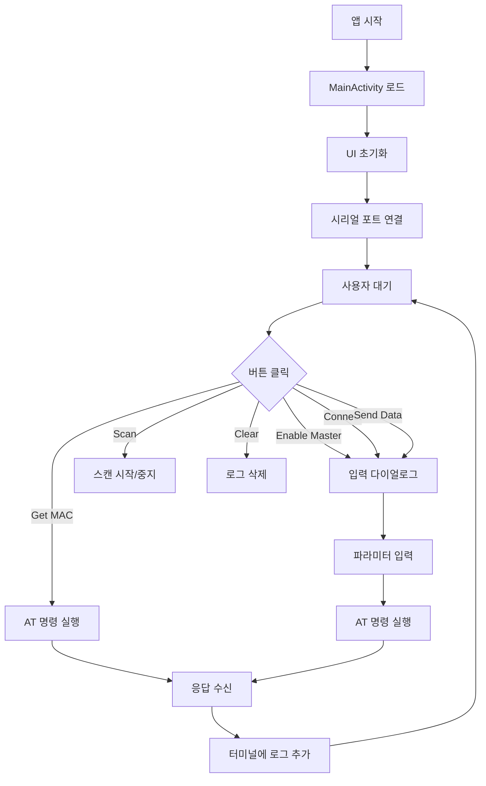

# UI 구조 분석

## UI 레이아웃 개요

AT_Terminal의 사용자 인터페이스는 **터미널 화면**과 **입력 다이얼로그**로 구성되며, Material Design을 따릅니다.

## 1. 메인 화면 (activity_main.xml)

### 전체 레이아웃 구조

```xml
<?xml version="1.0" encoding="utf-8"?>
<LinearLayout xmlns:android="http://schemas.android.com/apk/res/android"
    android:layout_width="match_parent"
    android:layout_height="match_parent"
    android:orientation="vertical">

    <!-- Toolbar -->
    <androidx.appcompat.widget.Toolbar
        android:id="@+id/toolbar"
        android:layout_width="match_parent"
        android:layout_height="?attr/actionBarSize"
        android:background="?attr/colorPrimary" />

    <!-- 제어 버튼 그룹 1 -->
    <LinearLayout
        android:layout_width="match_parent"
        android:layout_height="wrap_content"
        android:orientation="horizontal"
        android:padding="8dp">

        <Button android:id="@+id/btnEnableMaster" ... />
        <Button android:id="@+id/btnGetMac" ... />
        <Button android:id="@+id/btnScan" ... />
    </LinearLayout>

    <!-- 제어 버튼 그룹 2 -->
    <LinearLayout
        android:layout_width="match_parent"
        android:layout_height="wrap_content"
        android:orientation="horizontal"
        android:padding="8dp">

        <Button android:id="@+id/btnConnect" ... />
        <Button android:id="@+id/btnSendData" ... />
        <Button android:id="@+id/btnClear" ... />
    </LinearLayout>

    <!-- 터미널 로그 RecyclerView -->
    <androidx.recyclerview.widget.RecyclerView
        android:id="@+id/recyclerViewTerminal"
        android:layout_width="match_parent"
        android:layout_height="0dp"
        android:layout_weight="1"
        android:background="#000000" />

</LinearLayout>
```

### 주요 UI 컴포넌트

#### 1. Toolbar
```xml
<androidx.appcompat.widget.Toolbar
    android:id="@+id/toolbar"
    android:layout_width="match_parent"
    android:layout_height="?attr/actionBarSize"
    android:background="?attr/colorPrimary"
    android:elevation="4dp">

    <TextView
        android:layout_width="wrap_content"
        android:layout_height="wrap_content"
        android:text="AT Terminal"
        android:textColor="@android:color/white"
        android:textSize="20sp" />
</androidx.appcompat.widget.Toolbar>
```

#### 2. 제어 버튼들
```xml
<!-- Enable Master 버튼 -->
<Button
    android:id="@+id/btnEnableMaster"
    android:layout_width="0dp"
    android:layout_height="wrap_content"
    android:layout_weight="1"
    android:layout_margin="4dp"
    android:text="Enable Master"
    android:textColor="@android:color/white" />

<!-- Get MAC 버튼 -->
<Button
    android:id="@+id/btnGetMac"
    android:layout_width="0dp"
    android:layout_height="wrap_content"
    android:layout_weight="1"
    android:layout_margin="4dp"
    android:text="Get MAC"
    android:textColor="@android:color/white" />

<!-- Scan 버튼 (동적 변경) -->
<Button
    android:id="@+id/btnScan"
    android:layout_width="0dp"
    android:layout_height="wrap_content"
    android:layout_weight="1"
    android:layout_margin="4dp"
    android:text="Scan"
    android:textColor="@android:color/white" />
```

**Scan 버튼 상태 변경**:
```kotlin
private fun updateScanButton(scanning: Boolean) {
    if (scanning) {
        btnScan.text = "Stop Scan"
        btnScan.setBackgroundColor(getColor(android.R.color.holo_red_dark))
    } else {
        btnScan.text = "Scan"
        btnScan.setBackgroundColor(getColor(com.google.android.material.R.color.design_default_color_primary))
    }
}
```

#### 3. 터미널 RecyclerView
```xml
<androidx.recyclerview.widget.RecyclerView
    android:id="@+id/recyclerViewTerminal"
    android:layout_width="match_parent"
    android:layout_height="0dp"
    android:layout_weight="1"
    android:background="#000000"
    android:padding="8dp" />
```

## 2. 터미널 로그 아이템 (item_terminal_log.xml)

### 로그 아이템 레이아웃

```xml
<?xml version="1.0" encoding="utf-8"?>
<LinearLayout xmlns:android="http://schemas.android.com/apk/res/android"
    android:layout_width="match_parent"
    android:layout_height="wrap_content"
    android:orientation="horizontal"
    android:padding="4dp">

    <!-- 타임스탬프 -->
    <TextView
        android:id="@+id/tvTimestamp"
        android:layout_width="wrap_content"
        android:layout_height="wrap_content"
        android:text="[00:00:00.000]"
        android:textColor="#888888"
        android:textSize="12sp"
        android:fontFamily="monospace"
        android:layout_marginEnd="8dp" />

    <!-- 방향 표시 -->
    <TextView
        android:id="@+id/tvDirection"
        android:layout_width="wrap_content"
        android:layout_height="wrap_content"
        android:text=">"
        android:textColor="#2196F3"
        android:textSize="14sp"
        android:fontFamily="monospace"
        android:layout_marginEnd="8dp" />

    <!-- 로그 내용 -->
    <TextView
        android:id="@+id/tvContent"
        android:layout_width="0dp"
        android:layout_height="wrap_content"
        android:layout_weight="1"
        android:text="Log content"
        android:textColor="#FFFFFF"
        android:textSize="14sp"
        android:fontFamily="monospace" />

</LinearLayout>
```

### 로그 타입별 색상 및 표시

| 로그 타입 | 방향 | 색상 | 용도 |
|---------|------|------|------|
| SEND | `>` | 파란색 (#2196F3) | AT 명령 송신 |
| RECEIVE | `<` | 초록색 (#4CAF50) | 응답 수신 |
| SCAN | `<` | 노란색 (#FFC107) | 스캔 결과 |
| ERROR | `!` | 빨간색 (#F44336) | 에러 메시지 |
| INFO | `ℹ` | 회색 (#9E9E9E) | 정보 메시지 |

### 로그 예시

```
[14:30:25.123] > AT+ENABLEMASTER=1
[14:30:25.234] < OK
[14:30:26.345] > AT+GETMAC
[14:30:26.456] < MAC:AA:BB:CC:DD:EE:FF
[14:30:27.567] > AT+STARTNEWSCAN=,,80,,
[14:30:27.678] < OK
[14:30:28.789] < SCAN:MAC=11:22:33:44:55:66,NAME=Device1,RSSI=-45
[14:30:29.890] ! Hardware connection failed
[14:30:30.001] ℹ Serial port opened: /dev/ttyS1 @ 115200 baud
```

## 3. 입력 다이얼로그 (dialog_input.xml)

### 다이얼로그 레이아웃

```xml
<?xml version="1.0" encoding="utf-8"?>
<ScrollView xmlns:android="http://schemas.android.com/apk/res/android"
    android:layout_width="match_parent"
    android:layout_height="wrap_content"
    android:padding="24dp">

    <LinearLayout
        android:layout_width="match_parent"
        android:layout_height="wrap_content"
        android:orientation="vertical">

        <!-- Enable Master 입력 -->
        <RadioGroup
            android:id="@+id/rgEnableMaster"
            android:layout_width="match_parent"
            android:layout_height="wrap_content"
            android:orientation="horizontal">

            <RadioButton
                android:id="@+id/rbEnable"
                android:layout_width="0dp"
                android:layout_height="wrap_content"
                android:layout_weight="1"
                android:text="Enable (Master)" />

            <RadioButton
                android:id="@+id/rbDisable"
                android:layout_width="0dp"
                android:layout_height="wrap_content"
                android:layout_weight="1"
                android:text="Disable (Observer)" />
        </RadioGroup>

        <!-- Scan 파라미터 입력 -->
        <LinearLayout
            android:id="@+id/layoutScanParams"
            android:layout_width="match_parent"
            android:layout_height="wrap_content"
            android:orientation="vertical"
            android:visibility="gone">

            <EditText
                android:id="@+id/etMacAddress"
                android:layout_width="match_parent"
                android:layout_height="wrap_content"
                android:hint="MAC Address (AA:BB:CC:DD:EE:FF)"
                android:inputType="text" />

            <EditText
                android:id="@+id/etBroadcastName"
                android:layout_width="match_parent"
                android:layout_height="wrap_content"
                android:hint="Broadcast Name"
                android:inputType="text" />

            <EditText
                android:id="@+id/etMinRssi"
                android:layout_width="match_parent"
                android:layout_height="wrap_content"
                android:hint="Min RSSI (-100 to 0)"
                android:inputType="numberSigned" />

            <EditText
                android:id="@+id/etManufacturerId"
                android:layout_width="match_parent"
                android:layout_height="wrap_content"
                android:hint="Manufacturer ID (hex)"
                android:inputType="text" />

            <EditText
                android:id="@+id/etData"
                android:layout_width="match_parent"
                android:layout_height="wrap_content"
                android:hint="Filter Data (hex)"
                android:inputType="text" />
        </LinearLayout>

        <!-- Connect 입력 -->
        <LinearLayout
            android:id="@+id/layoutConnect"
            android:layout_width="match_parent"
            android:layout_height="wrap_content"
            android:orientation="vertical"
            android:visibility="gone">

            <EditText
                android:id="@+id/etConnectMac"
                android:layout_width="match_parent"
                android:layout_height="wrap_content"
                android:hint="MAC Address"
                android:inputType="text" />
        </LinearLayout>

        <!-- Send Data 입력 -->
        <LinearLayout
            android:id="@+id/layoutSendData"
            android:layout_width="match_parent"
            android:layout_height="wrap_content"
            android:orientation="vertical"
            android:visibility="gone">

            <EditText
                android:id="@+id/etHandle"
                android:layout_width="match_parent"
                android:layout_height="wrap_content"
                android:hint="Handle (1-65535)"
                android:inputType="number" />

            <EditText
                android:id="@+id/etHexData"
                android:layout_width="match_parent"
                android:layout_height="wrap_content"
                android:hint="Hex Data (48656C6C6F)"
                android:inputType="text" />
        </LinearLayout>

        <!-- 버튼 그룹 -->
        <LinearLayout
            android:layout_width="match_parent"
            android:layout_height="wrap_content"
            android:orientation="horizontal"
            android:layout_marginTop="16dp">

            <Button
                android:id="@+id/btnExecute"
                android:layout_width="0dp"
                android:layout_height="wrap_content"
                android:layout_weight="1"
                android:layout_marginEnd="8dp"
                android:text="Execute" />

            <Button
                android:id="@+id/btnCancel"
                android:layout_width="0dp"
                android:layout_height="wrap_content"
                android:layout_weight="1"
                android:text="Cancel" />
        </LinearLayout>

    </LinearLayout>
</ScrollView>
```

### 다이얼로그 타입별 표시

#### Enable Master 다이얼로그
- RadioGroup: Enable/Disable 선택
- 이전 선택값 SharedPreferences에서 로드

#### Scan 다이얼로그
- MAC Address: 특정 디바이스만 스캔 (선택)
- Broadcast Name: 이름 필터링 (선택)
- Min RSSI: 최소 신호 강도 (기본값: -80)
- Manufacturer ID: 제조사 ID 필터 (선택)
- Filter Data: 데이터 필터 (선택)

#### Connect 다이얼로그
- MAC Address: 연결할 디바이스 주소 (필수)
- MAC 주소 형식 검증

#### Send Data 다이얼로그
- Handle: GATT Characteristic Handle (필수)
- Hex Data: 전송할 16진수 데이터 (필수)
- Hex 형식 검증

## 4. UI 상호작용 플로우

### 메인 화면 플로우



### 다이얼로그 플로우

```kotlin
// 1. 다이얼로그 표시
InputDialogFragment.newInstance(InputDialogFragment.CommandType.SCAN)
    .show(supportFragmentManager, "SCAN")

// 2. 사용자 입력
// 3. Execute 버튼 클릭
// 4. 유효성 검증
// 5. MainActivity 콜백 호출
listener?.onStartScan(params)

// 6. AT 명령 실행
lifecycleScope.launch {
    val result = atCommandManager.startScan(params)
}

// 7. 결과 표시
addLogToTerminal(response, LogType.SCAN)
```

## 5. 색상 스킴

### 앱 전용 색상

```xml
<!-- colors.xml -->
<resources>
    <!-- 터미널 배경 -->
    <color name="terminal_background">#000000</color>

    <!-- 로그 타입별 색상 -->
    <color name="log_send">#2196F3</color>      <!-- 파란색 -->
    <color name="log_receive">#4CAF50</color>   <!-- 초록색 -->
    <color name="log_scan">#FFC107</color>      <!-- 노란색 -->
    <color name="log_error">#F44336</color>     <!-- 빨간색 -->
    <color name="log_info">#9E9E9E</color>      <!-- 회색 -->

    <!-- UI 요소 -->
    <color name="button_primary">#3F51B5</color>
    <color name="button_scan_stop">#F44336</color>
</resources>
```

## 6. 반응형 레이아웃

### 화면 크기별 대응

#### 휴대폰 (일반)
- 버튼 높이: 48dp
- 텍스트 크기: 14sp
- 패딩: 8dp

#### 태블릿 (큰 화면)
```xml
<!-- values-sw600dp/dimens.xml -->
<dimen name="button_height">56dp</dimen>
<dimen name="text_size">16sp</dimen>
<dimen name="padding">16dp</dimen>
```

### 가로/세로 모드
터미널 특성상 가로 모드에서도 동일한 레이아웃 사용
